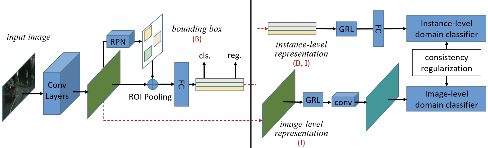

# Detectron2 implementation of Domain Adaptive Faster-RCNN

This is the implementation of CVPR 2018 work 'Domain Adaptive Faster R-CNN for Object Detection in the Wild'. The aim is to improve the cross-domain robustness of object detection, in the screnario where training and test data are drawn from different distributions. The original paper can be found [here](https://openaccess.thecvf.com/content_cvpr_2018/papers/Chen_Domain_Adaptive_Faster_CVPR_2018_paper.pdf) <br>
If you want to use this repo with your dataset follow the following guide.<br>
Please leave a star ⭐ if you use this repository for your project.

## DA-Faster R-CNN architecture
<center></center>

## Installation
You can use this repo following one of these three methods:<br>
NB: Detectron2 0.6 is required, installing other versions this code will not work.

### Google Colab
Quickstart here 👉 [](https://colab.research.google.com/gist/GiovanniPasq/9c0e99cde5df9aa09e3aff3295637a61/da-faster-rcnn.ipynb) <br>

Or load the ```DA-Faster-RCNN.ipynb``` notebook on Google Colab and follow the instructions inside.<br>

### Detectron 2 on your PC
Follow the official guide to install [Detectron2 0.6](https://github.com/facebookresearch/detectron2/blob/main/INSTALL.md)

### Detectron2 via Dockerfile
Follow the official guide to install [Detectron2 0.6](https://github.com/facebookresearch/detectron2/blob/main/docker/README.md)

## Dataset
You can find at the following links two datasets for Unsupervised Domain Adaptation for Object Detection:<br>
Create the Cityscapes-Foggy Cityscapes dataset following the instructions available [here](https://github.com/yuhuayc/da-faster-rcnn/tree/master/prepare_data)<br>
Synthetic to Real Artwork [UDA-CH](https://github.com/fpv-iplab/DA-RetinaNet#dataset)

## CNN Backbone
This implementation work with C4, DC5 and FPN backbones (R50 and R101).
FPN backbones should have higher performance.

## Data Preparation
If you want to use this code with your dataset arrange the dataset in the format of COCO or PASCAL VOC.
For COCO annotations, inside the script uda_train.py register your dataset using:
```
register_coco_instances("dataset_name_source_training",{},"path_annotations","path_images")
register_coco_instances("dataset_name_target_training",{},"path_annotations","path_images")
register_coco_instances("dataset_name_target_test",{},"path_annotations","path_images")
```
For PASCAL VOC annotations register your dataset using:
```
register_pascal_voc("city_trainS", "cityscape/VOC2007/", "train_s", 2007, ['car','person','rider','truck','bus','train','motorcycle','bicycle'])
register_pascal_voc("city_trainT", "cityscape/VOC2007/", "train_t", 2007, ['car','person','rider','truck','bus','train','motorcycle','bicycle'])
register_pascal_voc("city_testT", "cityscape/VOC2007/", "test_t", 2007, ['car','person','rider','truck','bus','train','motorcycle','bicycle'])
```
You need to replace the parameters inside the register_pascal_voc() function according to your dataset name and classes.

## Train
Replace at the following path if you use Google Colab  ```../usr/local/lib/python3.7/dist-packages/detectron2/modeling/meta_arch/``` the ```rcnn.py``` script with my ```rcnn.py```.<br>
Do the same for:<br>
```roi_heads.py``` file at the path ```../usr/local/lib/python3.7/dist-packages/detectron2/modeling/roi_heads/```<br>
```rpn.py``` file at the path ```../usr/local/lib/python3.7/dist-packages/detectron2/modeling/proposal_generator/```<br>

Inside the folder ```../usr/local/lib/python3.7/dist-packages/detectron2/modeling/``` create a folder called ```da_modules``` and upload the four files:<br>```grad_rev_layer.py```<br>```image_level_discriminators.py```<br>```instance_level_discriminators.py```<br>```consistency_regularization_loss.py```<br>
NB: Python version may vary <br>
If you use your pc you need to replace the files that you will find in the Detectron2 folder that you have cloned from the official GitHub repo.
```
detectron2/modeling/meta_arch/
detectron2/modeling/roi_heads/
detectron2/modeling/proposal_generator/
```

## Test
If you want to test the model load the new weights, set to 0 the number of iterations and rerun the same script used for the training. If the annotations are in PASCAL VOC use the ```PascalVOCDetectionEvaluator``` otherwise ```COCOEvaluator```

## Related Work
[DA-RetinaNet](https://github.com/fpv-iplab/DA-RetinaNet)<br>
[STMDA-RetinaNet](https://github.com/fpv-iplab/STMDA-RetinaNet)<br>
